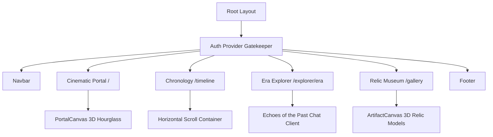

# Chronos: Interactive Spatial History Experience

Chronos is a premium, interactive web application that lets you travel through time. You can explore ancient civilizations, study historical monuments and relics in 3D, and chat directly with simulated historical figures from different eras. 

The application is built using **Next.js (App Router)**, **Tailwind CSS**, **Framer Motion**, and **Three.js** (via React Three Fiber).

---

## 📸 Screenshots & Previews

### 🔐 1. Access Gatekeeper (Sign In / Sign Up)
Before accessing the site, users must sign in or sign up with their Email ID. This protects the historical coordinates and manages user access.


### ⏳ 2. Global Chronological Timeline
A horizontal, interactive timeline charting milestones across Ancient India, Rome, the Renaissance, and a Cyberpunk Future.


### 🏛️ 3. Relic Museum Gallery (3D WebGL)
Inspect 3D wireframe models of retrieved historical relics. Rotate them in three dimensions using your mouse!


---

## 🌟 Key Features

1. **Gatekeeper Security**: Anyone accessing the portal must sign in or sign up first with their email ID. Access is fully restricted until authentication is complete.
2. **Interactive 3D Museum**: View and interact with 10 legendary historical relics (like the Roman Laurel, Maurya Silver Coin, and Galileo's Astrolabe) rendered procedurally in WebGL. Left-click and drag to rotate them in three dimensions!
3. **Horizontal Chronology**: Scroll through history sideways, with dedicated color-coded sectors for Rome, India, the Renaissance, and the Future.
4. **Simulated Era Chat (Echoes of the Past)**: Chat directly with simulated historical figures (like Julius Caesar, Emperor Ashoka, and Galileo Galilei) inside the Explorer view.
5. **AI Chrono-Guide Widget**: An AI assistant widget available on all pages to answer questions about any event, relic, or monument.

---

## 🏛️ System Architecture



---

## 📂 Project Directory Structure

```bash
├── public/                 # Static Assets & Screenshots
│   └── screenshots/        # Application screenshots for GitHub
├── src/
│   ├── app/
│   │   ├── explorer/
│   │   │   └── [era]/     # Dynamic Hub with "Echoes of the Past" Chat Interface
│   │   │       └── page.tsx
│   │   ├── gallery/       # 3D Artifact Museum Grid (10 Relics)
│   │   │   └── page.tsx
│   │   ├── timeline/      # Horizontal Scrolling Chronology
│   │   │   └── page.tsx
│   │   ├── globals.css    # Color tokens (Charcoal, Warm Ivory, Brushed Gold)
│   │   ├── layout.tsx     # Google Font loading & core layout wrappers
│   │   └── page.tsx       # Cinematic Portal Landing
│   └── components/
│       ├── AuthProvider.tsx   # Login/Register Gatekeeper Overlay
│       ├── ArtifactCanvas.tsx # WebGL Relics (Laurel, Astrolabe, Chrono-Core)
│       ├── Navbar.tsx         # Responsive glassmorphic layout
│       └── PortalCanvas.tsx   # WebGL Cinematic Hourglass
├── tsconfig.json          # TypeScript config
├── tailwind.config.ts     # Tailwind configuration (v4)
└── package.json           # Next.js and WebGL dependencies
```

---

## 🎨 Creative Design & Quality Standards

- **Base Background**: `#1A1A1A` (Deep Archival Charcoal) - Provides a high-contrast dark foundation for spatial elements.
- **Typography**: `#FDFBF7` (Warm Ivory) - Elegant headings in *Playfair Display* and clean, highly legible body copy in *Outfit*.
- **Accents**: `#D4AF37` (Brushed Gold) - Used selectively for highlights, hover indicators, active navigation states, and 3D metal reflection tones.
- **Micro-interactions**: Hover effects speed up rotation in the WebGL models and expand timeline cards, creating an alive, responsive UI.
- **3D Asset Reliability**: To prevent loading failures caused by broken or slow external `.gltf` asset downloads, all models (Hourglass, Roman Laurel, Renaissance Astrolabe, and Cyberpunk Chrono-Core) are constructed **procedurally** using React Three Fiber's built-in mathematical geometries and physical materials.

---

## 🚀 Execution & Running Locally

### 1. Installation
Install the project dependencies:
```bash
npm install
```

### 2. Run the Development Server
Launch the development server locally:
```bash
npm run dev
```
Open [http://localhost:3000](http://localhost:3000) with your Brave Browser to experience Chronos.

### 3. Production Build
Verify code compilation and optimization:
```bash
npm run build
```
The application will output static server assets optimized for deployment.

---

## 🌐 Automatic Deployment

Chronos is configured for zero-configuration deployments on **Vercel**. 
When deploying, client-side WebGL modules are loaded using dynamic Next.js imports (`ssr: false`) to ensure smooth server-side builds.
