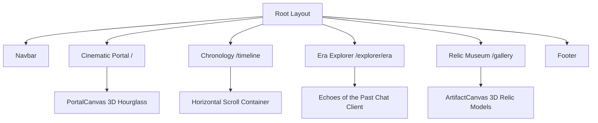

# Chronos: Interactive Spatial History Experience

Chronos is a high-fidelity, production-grade interactive spatial history experience built using **Next.js (App Router)**, **Tailwind CSS**, **Framer Motion**, and **Three.js** via React Three Fiber.

The system allows users to traverse historical eras (Ancient Rome, the Renaissance, and a Cyberpunk Future) in three dimensions, interact with simulated historical figures, and examine museum relics using client-side WebGL procedural renderings.

---

## 🏛️ System Architecture



---

## 📂 Project Directory Structure

```bash
├── public/                 # Static Assets (favicon, icons)
├── src/
│   ├── app/
│   │   ├── explorer/
│   │   │   └── [era]/     # Dynamic Hub with "Echoes of the Past" Chat Interface
│   │   │       └── page.tsx
│   │   ├── gallery/       # 3D Artifact Museum Grid
│   │   │   └── page.tsx
│   │   ├── timeline/      # Horizontal Scrolling Chronology
│   │   │   └── page.tsx
│   │   ├── globals.css    # Color tokens (Charcoal, Warm Ivory, Brushed Gold)
│   │   ├── layout.tsx     # Google Font loading & core layout wrappers
│   │   └── page.tsx       # Cinematic Portal Landing
│   └── components/
│       ├── ArtifactCanvas.tsx # WebGL Relics (Laurel, Astrolabe, Chrono-Core)
│       ├── Navbar.tsx         # Responsive glassmorphic layout
│       └── PortalCanvas.tsx   # WebGL Cinematic Hourglass
├── tsconfig.json          # TypeScript config
├── tailwind.config.ts     # Tailwind configuration (v4)
└── package.json           # Next.js and WebGL dependencies
```

---

## 🎨 Creative Design & Quality Standards

- **Base Background**: `#1A1A1A` (Deep Archival Charcoal) - Provides a high-contrast dark foundation for spatial elements.
- **Typography**: `#FDFBF7` (Warm Ivory) - Elegant headings in *Playfair Display* and clean, highly legible body copy in *Outfit*.
- **Accents**: `#D4AF37` (Brushed Gold) - Used selectively for highlights, hover indicators, active navigation states, and 3D metal reflection tones.
- **Micro-interactions**: Hover effects speed up rotation in the WebGL models and expand timeline cards, creating an alive, responsive UI.
- **3D Asset Reliability**: To prevent loading failures caused by broken or slow external `.gltf` asset downloads, all models (Hourglass, Roman Laurel, Renaissance Astrolabe, and Cyberpunk Chrono-Core) are constructed **procedurally** using React Three Fiber's built-in mathematical geometries and physical materials.

---

## 🚀 Execution & Running Locally

### 1. Installation
Install the project dependencies:
```bash
npm install
```

### 2. Run the Development Server
Launch the development server locally:
```bash
npm run dev
```
Open [http://localhost:3000](http://localhost:3000) with your browser to experience Chronos.

### 3. Production Build
Verify code compilation and optimization:
```bash
npm run build
```
The application will output static server assets optimized for deployment.

---

## 🌐 Automatic Deployment

Chronos is configured for zero-configuration deployments on **Vercel**. 
When deploying, client-side WebGL modules are loaded using dynamic Next.js imports (`ssr: false`) to ensure smooth server-side builds.
